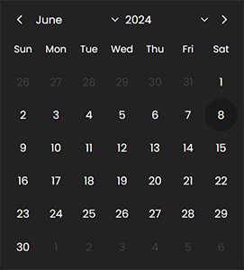

# Datera

Datera is a library designed to manage date input and selection. It offers extensive flexibility in configuring date selection behavior and includes methods for interacting with the date input field. Users can initialize Datera instances with various options, including initial selected dates, selectable year ranges, disabled and enabled dates, the start day of the week, and themes for styling the calendar.

Version: 1.0.0 &middot; Last updated at: 06-08-2024 &middot; Author: [KoalNix](https://github.com/KoalNix)

### Preview



### Syntax

```javascript
new window.Datera(input, { options }).mount();
```

### Parameters

- `input`: The input element or CSS selector for the date input field.
- `options`: An object containing optional configuration settings for the `Datera` instance.

#### Options

- `value`: An array of Date objects representing initial selected dates it should be array with dates (even if single date should be selected).
- `divider`: Used when multiple dates are selected in order to set as input values.
- `minYear`: The minimum selectable year.
- `maxYear`: The maximum selectable year.
- `disabledDates`: An array of Date objects representing disabled dates (set null if not using).
- `enabledDates`: An array of Date objects representing enabled dates (set null if not using).
- `startWeek`: The index of the first day of the week.
- `daysOfWeek`: An array of strings representing the names of the days of the week.
- `selectionType`: The type of date selection: `single`, `list`, `range`.
- `theme`: The theme for styling the calendar. Available options include various dark and light themes: `theme1-dark`, `theme1-light`, `theme2-dark`, `theme2-light`, `theme3-dark`, `theme3-light`, `theme4-dark`, `theme4-light`, `theme5-dark`, `theme5-light`.
